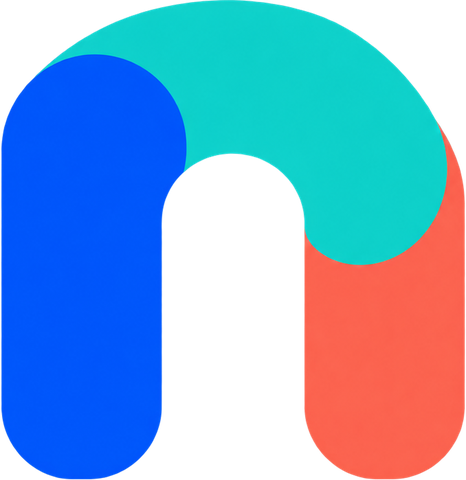

<p align="center">
  
</p>

# Noo

A fast, native [Nextcloud](https://nextcloud.com) client built with Flutter
and Material 3.

Noo is a clean, modern way to browse and manage the files on your own
Nextcloud server: files, photos, shares, activity, and trash in one app,
themed to match your device and laid out for both phones and tablets.

Website: <https://noo.ayushya.dev>

> Noo is an independent, unofficial client. It is not affiliated with or
> endorsed by Nextcloud GmbH.

## Why Noo?

Self-hosting gives you control over your files. Noo makes that cloud easy to
use day to day, whether you're opening a file, sharing a folder, or taking
your photos offline.

- **Easy for everyone**: give yourself, your family, or your team a simple
  way to browse files and manage shares on the server you already use.
- **Ready away from Wi-Fi**: choose the files and folders you want on your
  device, and keep them within reach when you're offline.
- **Make it feel like yours**: put your favorite tabs and actions first, and
  adjust the theme and layout around how you actually use your cloud.
- **Private by design**: Noo talks only to your server, never sees your
  password, and has no analytics or trackers.

## Features

- **Files**: browse, upload, move, copy, rename, delete, and favorite files
  and folders; sort and filter per folder; list or grid view
- **Photos**: a media gallery with a full-screen viewer for images and video
- **Viewer**: images, video, PDF (pinch to zoom), Markdown and text, with a
  pull-up details panel (info, activity, sharing)
- **Shares, Recent, Favorites, Activity, Trash**: see and manage what you
  have shared, what changed, and what you deleted
- **Search** across your server
- **Offline and sync**: keep files available offline and sync chosen folders
  in the background
- **Multiple accounts**: switch between saved accounts from the avatar menu
- **App lock**: optionally require device authentication to open the app,
  switch accounts, or reveal hidden files
- **Share to Noo**: upload from any app's share sheet
- **Make it yours**: Material You dynamic color, five accent colors,
  light/dark/AMOLED, attached or floating bottom bar, hamburger or avatar
  navigation, adjustable upload button, and a tablet layout with a sidebar
- **Secure sign-in**: authenticates through Nextcloud's Login Flow v2. You
  sign in through your browser, and Noo never sees or stores your password,
  only a scoped app password

## Getting started

Prerequisites:

- [Flutter](https://docs.flutter.dev/get-started/install) (SDK `^3.12.2`)
- An Android device or emulator, or an iOS device or simulator
- A Nextcloud server with Login Flow v2 enabled (on by default since
  Nextcloud 15)

```bash
flutter pub get
flutter run
```

On first launch, enter your server's address. Noo opens your browser to
finish signing in.

## Building

```bash
flutter build apk       # Android (debug-signed unless you configure a key)
flutter build ios       # iOS
```

Release builds read signing details from `android/key.properties` or from
`RELEASE_KEYSTORE_*` environment variables (see `android/app/build.gradle.kts`).
Neither the keystore nor `key.properties` is, or should ever be, committed.
Without them, release builds fall back to debug signing.

## Tech stack

Flutter with Material 3, [`provider`](https://pub.dev/packages/provider) for
state management, and `http`/`dio` talking directly to Nextcloud's WebDAV and
OCS APIs, with no bundled Nextcloud SDK. Android has native workers for
transfers and background sync.

## Contributing

Contributions are welcome. Please read [`CONTRIBUTING.md`](CONTRIBUTING.md)
first. In short:

```bash
flutter test      # run tests
flutter analyze   # static analysis / lints
```

Architecture, server integration, styling conventions, and code standards are
documented in [`CLAUDE.md`](CLAUDE.md) and `.claude/context/`, written for
both human and AI contributors.

## Privacy

Noo talks only to the Nextcloud server you point it at. It has no analytics
and no third-party tracking. Read the full [privacy policy](https://noo.ayushya.dev/privacy).

## Acknowledgements

Typefaces [Instrument Sans](https://fonts.google.com/specimen/Instrument+Sans)
and [Schibsted Grotesk](https://fonts.google.com/specimen/Schibsted+Grotesk)
are bundled under the SIL Open Font License, and icons are from
[Lucide](https://lucide.dev). Those keep their own licenses; the license
below covers Noo's own code and assets.

## License

Noo is source-available under the
[PolyForm Shield License 1.0.0](LICENSE). In plain terms: you may read, build,
run, and modify the code, and contribute changes back, but you may not use it
to make a product or service that competes with Noo. Please do not republish
it as your own app.

Contributions are welcome under the terms in
[`CONTRIBUTING.md`](CONTRIBUTING.md).

### Why PolyForm Shield?

I want the code to be open to read, learn from, build, and improve, while
keeping anyone from lifting it and shipping a competing copy of the app.
Permissive licenses (MIT, Apache) allow exactly that, and copyleft ones
(GPL) still allow a rebranded fork. PolyForm Shield sits in between: it is
not an OSI "open source" license, and I'm not claiming it is, but it keeps
the code available while protecting the project.

## Where development happens

The source of truth is a self-hosted Gitea instance, and this GitHub
repository is a read-only mirror plus the public issue tracker. I keep it
that way so that I own my hosting, builds, and release credentials rather
than depending on a third party for them. You don't have to use Gitea:
open issues and pull requests here as usual. Open PRs are imported to my
instance, reviewed and merged there, and `main` is mirrored back here, so a
merged PR may show as closed with a link to the commit instead of "Merged".
See [`CONTRIBUTING.md`](CONTRIBUTING.md) for details.
